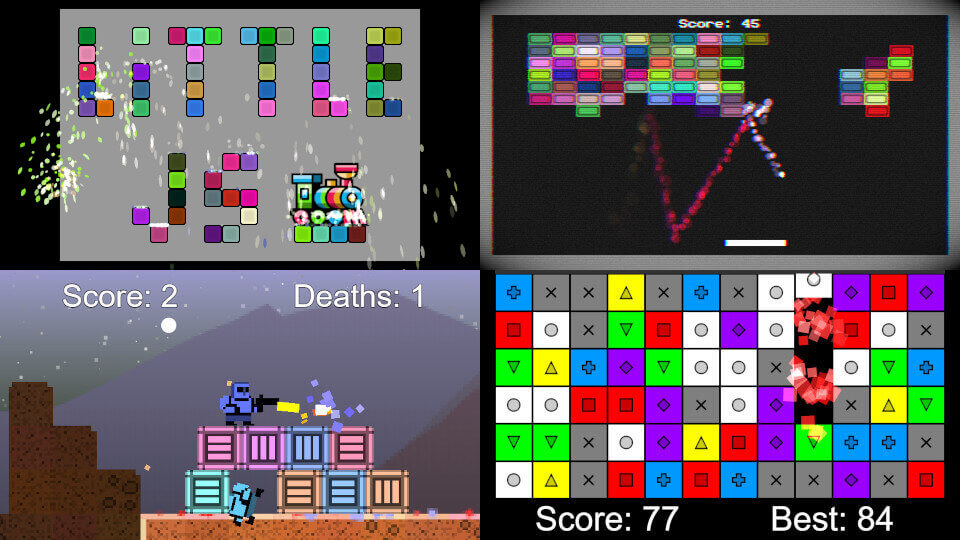

#  LittleJS - The Tiny JavaScript Game Engine That Can

## All aboard!

LittleJS is a super lightweight JavaScript game engine with a fast hybrid rendering system. It provides a comprehensive set of tools including rendering, physics, particles, sound effects, music, input handling, and debug tools. The code is very clean and well documented with a variety of examples to get you started. Choo-Choo! 🚂

  
## [Demo](https://killedbyapixel.github.io/LittleJS/examples/starter/) | [Docs](https://killedbyapixel.github.io/LittleJS/docs) | [Trailer](https://youtu.be/chuBzGjv7Ms) | [Discord](https://discord.gg/zb7hcGkyZe)

## Examples

### [Starter Project](https://killedbyapixel.github.io/LittleJS/examples/starter/) - Clean demo with only a few things to get you started
### [Puzzle Game](https://killedbyapixel.github.io/LittleJS/examples/puzzle/) - Match 3 puzzle game with HD rendering and high score tracking
### [Platformer](https://killedbyapixel.github.io/LittleJS/examples/platformer/) - Platformer/shooter with procedural generation and destruction
### [Breakout](https://killedbyapixel.github.io/LittleJS/examples/breakout/)- Breakout game with post processing effect
### [Stress Test](https://killedbyapixel.github.io/LittleJS/examples/stress/) - Max sprite/object test and music system demo
### [Particle System Designer](https://killedbyapixel.github.io/LittleJS/examples/puzzle/) - Particle system editor and visualizer

## Features

- Very small footprint with no dependencies
- Can update and render 10,000+ objects at 60fps, often many times more
- Object oriented system with fast 2D physics and collision handling for axis aligned boxes
- Positional audio effects with [ZzFX](https://killedbyapixel.github.io/ZzFX/) and music with [ZzFXM](https://keithclark.github.io/ZzFXM/), mp3s, or wavs
- Input processing system with keyboard, mouse, gamepad, and touch support
- Particle effects system (particle editor/designer in progress)
- Medal system tracks and displays achievements with Newgrounds integration
- Several easy to understand example projects you can build on
- Apply [Shadertoy](https://www.shadertoy.com) compatible shaders for post processinge effects
- Debug tools and debug rendering system
- [Full documentation](https://killedbyapixel.github.io/LittleJS/docs) automatically generated from the source code block tags with [JSDoc](https://github.com/jsdoc/jsdoc)
- Build system automatically combines everything, minifies, and removes unused code
- For size coding competitions like [js13kGames](https://js13kgames.com/), starter project builds to a 7KB zip file
- Easily build a Windows executable with [Electron](https://www.electronjs.org/) for distribution on platforms like Steam
- Open Source with the [MIT license](https://github.com/KilledByAPixel/LittleJS/blob/main/LICENSE) so it can be used for anything you want
- Can be imported as a JavaScript module and includes [an example module project](https://killedbyapixel.github.io/LittleJS/examples/module)
- Compatible with TypeScript and includes [an example TS project](https://killedbyapixel.github.io/LittleJS/examples/typescript)

## Builds

To easily include LittleJS in your game, you can use one of the 3 pre-built js files. These are also built automatically by the build scripts.

- [littlejs.js](https://github.com/KilledByAPixel/LittleJS/blob/main/build/littlejs.js) - The full game engine with debug mode available
- [littlejs.release.js](https://github.com/KilledByAPixel/LittleJS/blob/main/build/littlejs.release.js) - The engine optimized for release builds
- [littlejs.min.js](https://github.com/KilledByAPixel/LittleJS/blob/main/build/littlejs.min.js) - The engine in release mode and minified

LittleJS can also be imported as a module. There are two module flavors that are automatically built.

- [littlejs.esm.js](https://github.com/KilledByAPixel/LittleJS/blob/main/build/littlejs.esm.js) - The engine exported as a module with debug mode available
- [littlejs.esm.min.js](https://github.com/KilledByAPixel/LittleJS/blob/main/build/littlejs.esm.min.js) - The engine exported as a minified module in release mode

There is an [enginebuild.bat](https://github.com/KilledByAPixel/LittleJS/blob/main/src/engineBuild.bat) file included that will rebuild the engine files. The starter project example also includes a batch file [build.bat](https://github.com/KilledByAPixel/LittleJS/blob/main/examples/starter/build.bat) that compresses everything into a tiny zip file using Google Closure, UglifyJS, Roadroller, and ECT. You must first run npm install to setup the necessary npm dependencies.

## Debugging

Debug builds of LittleJS have a special menu that can be opened by pressing ~, the tilde key.

- ~: Debug Overlay
- 1: Debug Physics
- 2: Debug Particles
- 3: Debug Gamepads
- 4: God Mode
- 5: Save Screenshot

## Simple Code

This engine is made with simplicity in mind using simple and easy to read code. There are only a few files used by the entire engine...

- [engine.js](https://github.com/KilledByAPixel/LittleJS/blob/main/src/engine.js) - Top level engine init, update, and render
- [engineSettings.js](https://github.com/KilledByAPixel/LittleJS/blob/main/src/engineSettings.js) - Global engine settings
- [engineObject.js](https://github.com/KilledByAPixel/LittleJS/blob/main/src/engineObject.js) - Base object class and physics
- [engineDraw.js](https://github.com/KilledByAPixel/LittleJS/blob/main/src/engineDraw.js) - Code for canvas drawing and text
- [engineInput.js](https://github.com/KilledByAPixel/LittleJS/blob/main/src/engineInput.js) - Input for keyboard, mouse, touch, and gamepad
- [engineUtilities.js](https://github.com/KilledByAPixel/LittleJS/blob/main/src/engineUtilities.js) - Vector2, Color, and Timer clases and math functions

Optional Components, these components are built to synergize with the rest of the engine but are not necessary...

- [engineAudio.js](https://github.com/KilledByAPixel/LittleJS/blob/main/src/engineAudio.js) - Spacial sound effects, and zzfx sound generator
- [engineTileLayer.js](https://github.com/KilledByAPixel/LittleJS/blob/main/src/engineTileLayer.js) - Tile layer rendering and collision
- [engineParticles.js](https://github.com/KilledByAPixel/LittleJS/blob/main/src/engineParticles.js) - Particle system with fast rendering and collision
- [engineWebGL.js](https://github.com/KilledByAPixel/LittleJS/blob/main/src/engineWebGL.js) - Super fast rendering with WebGL and post processing
- [engineMedals.js](https://github.com/KilledByAPixel/LittleJS/blob/main/src/engineMedals.js) - Achievement tracker with Newgrounds integration
- [engineDebug.js](https://github.com/KilledByAPixel/LittleJS/blob/main/src/engineDebug.js) - Debug rendering system and information overlay

## Games Made With LittleJS

Here are a few examples of amazing games made useing LittleJS.

- [Space Huggers](https://www.newgrounds.com/portal/view/819609) - Run and gun platformer with procedural levels
- [Undergrowth](https://undergrowth.squidband.uk/) - An interactive music videogame for the band Squid
- [Space Huggers - JS13K Edition](https://github.com/KilledByAPixel/SpaceHuggers) - Original js13k game with source code
- [Isletopia](https://store.steampowered.com/app/1861260/Isletopia) - Relaxing strategy game of greenifying barren islands
- [Dead Again](https://js13kgames.com/entries/dead-again) - Top down survial horror by [sanojian & repsej](https://github.com/sanojian/js13k_2022)
- [Hel's Trial](https://js13kgames.com/entries/hels-trial) - Turn based RPG by [Sebastian Dorn](https://github.com/sebadorn/js13k-2022-death)
- [Bit Butcher](https://js13kgames.com/entries/bit-butcher) - Survival crafting game by [Deathray Games](https://github.com/deathraygames/bit-butcher)
- [Necrotic Commander](https://js13kgames.com/entries/necrotic-commander) - Tower defense game by [Daniel Jeffery](https://github.com/d-jeffery/NecroticCommander)
- [Boxing up Bamboo](https://patrickgh3.itch.io/boxing-up-bamboo) - A challenging puzzle game by [Patrick Traynor](https://cwpat.me/about)
- Send me your games!

