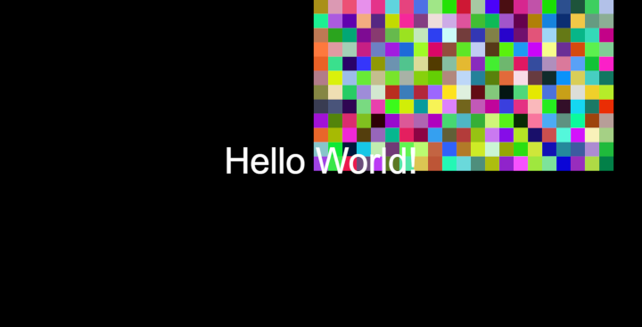
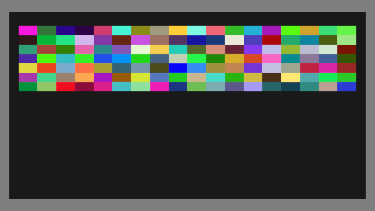
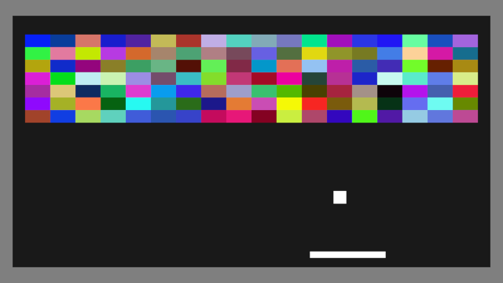
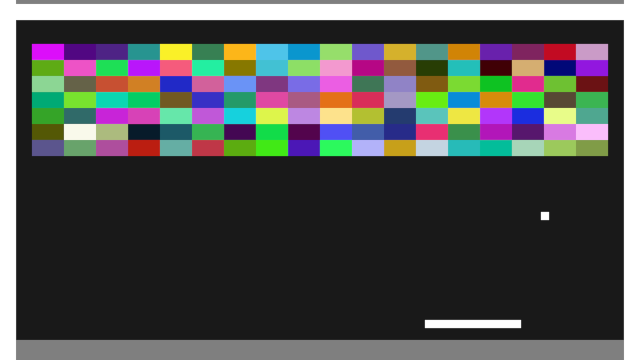
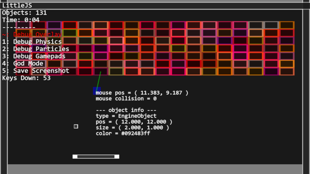
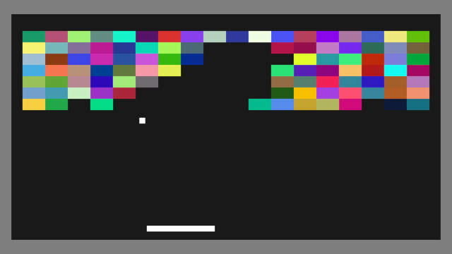
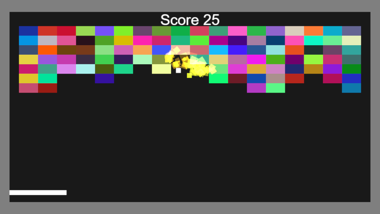
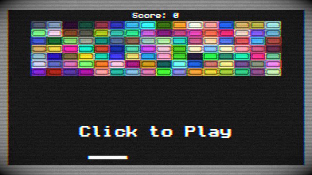

# LittleJS Breakout Tutorial

For this tutorial we will start with the empty project in the LittleJS examples folder. This is a blank template to start a new project.

The empty project has only 3 files: one for html, one for js, and one image. The index.html and image files will not need to be changed for this example. The 
[game.js](https://github.com/KilledByAPixel/LittleJS/blob/main/examples/empty/game.js) file contains a stubbed out project with all the JavaScript code and is the only file we will be working with today.

You can get the [LittleJS code using GitHub](https://github.com/KilledByAPixel/LittleJS) or call ```npm install littlejsengine```

In this tutorial we will make a breakout style game with a player controllable paddle, a ball that bounces, and bricks that break when hit. This is a great introduction to LittleJS and takes only around 30 minutes to complete.

## [You can play the result of this tutorial here.](https://killedbyapixel.github.io/LittleJS/examples/breakoutTutorial/)


## Create the Bricks

The first step is to make a 2D grid of brick objects in gameInit. As a placeholder we will create an EngineObject for each cell in the grid and set it to have a random color.

```javascript
// create bricks
for(let x=0; x<=20; x++)
for(let y=0; y<=20; y++)
{
    const brick = new EngineObject(vec2(x,y)); // create a brick
    brick.color = randColor(); // give brick a random color
}
```

That will make a square of 20×20 engine objects, we can adjust it as we go. It also assigns the color property of each brick to a random color.



It is completely off center and may not look like much yet, but it’s a start!

## Improve the Bricks

Let’s make the bricks more rectangular by passing vec2(2,1) to the size parameter of Engine Object. We will need to adjust the loop to add 2 for each x iteration. Also we can use a Vector2 to describe the size of the level.

```javascript
// create bricks
const levelSize = vec2(20, 20);
for(let x=0; x<=levelSize.x; x+=2)
for(let y=0; y<=levelSize.y; y+=1)
{
    const brick = new EngineObject(vec2(x,y), vec2(2,1)); // create a brick
    brick.color = randColor(); // give brick a random color
}
```

## Move the Camera

Let’s move the camera to the center of our level by setting the cameraPos variable to half the level size.

```javascript
cameraPos = levelSize.scale(.5); // center camera in level
```

We’ll also start with a blank slate by commenting out the default “Hello World!” text in gameRenderPost.

```javascript
// drawTextScreen('Hello World!', mainCanvasSize.scale(.5), 80);
```


It’s getting closer! The camera is now centered and blocks are rectangular.

## Modify the Level Size

For this example we will use a fixed size canvas. This will let the drawing canvas always be the same resolution, even if the window size changes. Black space is added on the sides to compensate. It’s a great option for any game that uses a single screen like this.

To enable it we will set canvasFixedSize in gameInit to use 720p resolution.

```javascript
canvasFixedSize = vec2(1280, 720); // use a 720p fixed size canvas
```

Before we tweak the level size, let’s add this bit of code to gameRender to show the size of the level. This will cause some rects to be drawn each frame before the engine objects. To create color objects we pass in RGB values between 0 and 1.

```javascript
drawRect(cameraPos, vec2(100), new Color(.5,.5,.5)); // draw background
drawRect(cameraPos, levelSize, new Color(.1,.1,.1)); // draw level boundary
```

We also need to make levelSize a global by moving it to the top so it can be accessed from other functions.

```javascript
const levelSize = vec2(38, 20); // size of play area
```

Now we can see the boundaries of our level and tweak the size to fill the canvas. I found that a level size of vec2(38, 20) works well here.

We can also adjust the for loop where the bricks are created to make them only fill the top middle part of the level.

```javascript
for(let x=2;  x<=levelSize.x-2; x+=2)
for(let y=12; y<=levelSize.y-2; y+=1)
{
    const brick = new EngineObject(vec2(x,y), vec2(2,1)); // create a brick
    brick.color = randColor(); // give brick a random color
}
```



Now that looks almost like a breakout game!

## Create the Player Paddle

For the player’s paddle, let’s create a new class of object that extends the built in EngineObject. This will allow us to control movement with the mouse. In this Paddle class we will just add some new code to the update function which is automatically called each frame by the engine.

```javascript
class Paddle extends EngineObject
{
    update()
    {
        this.pos.x = mousePos.x; // move paddle to mouse
    }
}
```

Then we just need to create the paddle in gameInit.

```javascript
new Paddle; // create player's paddle
```

There is now a square paddle that moves along the bottom of the screen.

Let’s make the paddle wider and move it up a smidge by adding a constructor to the Paddle class.

```javascript
constructor()
{
    super(vec2(0,1), vec2(6,.5)); // set object position and size
}
```


Now there is a player controllable paddle that moves along the bottom of the screen.

You can also add this code to the paddle update that will keep the paddle from following the mouse offscreen, though it is not required.

```javascript
// clamp paddle to level size
this.pos.x = clamp(this.pos.x, this.size.x/2, levelSize.x - this.size.x/2);
```

## Create the Ball
The final missing piece is of course that ball that moves around and bounces off of stuff. We will leverage the built in physics solver to handle all the ball’s physics and collision math.

We can create a Ball class the same way we created the paddle. In this case we will also apply some velocity to ball so it starts moving right away.

```javascript
class Ball extends EngineObject 
{
    constructor(pos)
    {
        super(pos); // set object position

        this.velocity = vec2(-.1, -.1); // give ball some movement
    }
}
```

Then we just need to create the ball in gameInit, passing in the camera position for it’s location.

```javascript
new Ball(cameraPos); // create a ball
```

## Make the Ball Collide

You may have noticed that the ball goes right through the paddle and bricks. To enable collision we just need to call setCollision on the ball and the paddle by adding a call in both of their constructors.

```javascript
this.setCollision(); // make object collide
```

Now the ball collides but unfortunately also pushes the paddle away, not quite what we want. To prevent he paddle from being moved by physics we will make it use static physics by setting it’s mass to 0 in the paddle constructor.

```javascript
this.mass = 0; // make object have static physics
```

Getting closer, the paddle is not pushed away but the ball doesn’t bounce either. To make it bounce, we need to set the ball’s elasticity which controls how much it will bounce.

```javascript
this.elasticity = 1; // make object bounce
```



It works! The ball now bounces off the paddle, still not the walls or blocks yet though.

Before we continue, let’s make the ball a bit smaller by changing the super call in it’s constructor.

```javascript
super(pos, vec2(.5)); // set object position and size
```

## Make the Ball Bounce Off Walls

Next, let’s make the ball bounce when it hits the top or sides of the screen. To do this, we will make a Wall object class that works similar to the paddle but without an update function.

```javascript
class Wall extends EngineObject
{
    constructor(pos, size)
    {
        super(pos, size); // set object position and size

        this.setCollision(); // make object collide
        this.mass = 0; // make object have static physics
    }
}
```

We can create walls on the sides and top by adding a few more lines of code to the gameInit function.

```javascript
// create walls
new Wall(vec2(-.5,levelSize.y/2),            vec2(1,100)) // top
new Wall(vec2(levelSize.x+.5,levelSize.y/2), vec2(1,100)) // left
new Wall(vec2(levelSize.x/2,levelSize.y+.5), vec2(100,1)) // right
```



Now we have white walls around the outside that block the ball. These walls should be invisible so we will set their color to be transparent by adding another line to the Wall constructor.

```javascript
this.color = new Color(0,0,0,0); // make object invisible
```

## Debug Display

This is a good time to try opening up the debug info by pressing ~. This feature will allow for a selection of debug overlays while also showing all game objects with more info displayed for the object closest to the mouse. It can be really useful when trying to diagnose bugs and understand what is going on.



As you can see, the wall objects are still present even though they are now invisible.

## Respawn the Ball

We should respawn the ball when it goes below the screen so players can keep playing.

To do this, we will need to make a global ball object.

```javascript
let ball; // keep track of ball object
```

We can remove the old code that was creating a new ball in gameInit, and instead create the ball in gameUpdate, only when it is needed.

```javascript
// if there is no ball or ball is below level
if (!ball || ball.pos.y < -1)
{
    // destroy old ball
    if (ball)
        ball.destroy();

    // create a ball
    ball = new Ball(cameraPos);
}
```

Don’t forget to destroy the old ball before creating the new one! Though it doesn’t really matter for this simple example, it would cause the old balls to continue existing while being updated and rendered. That could really slow things in bigger games with thousands of objects.

## Break the Bricks

Still, the ball doesn’t collide with the bricks much less break them and it wouldn’t be breakout without that. So we need to make the brick collide with the ball, just like the walls, so let’s start with Brick class that is the same as Wall.

```javascript
class Brick extends EngineObject
{
    constructor(pos, size)
    {
        super(pos, size);

        this.setCollision(); // make object collide
        this.mass = 0; // make object have static physics
    }
}
```

And we will just change the for loop in gameInit to use the Brick class.

```javascript
const brick = new Brick(vec2(x,y), vec2(2,1)); // create a brick
```

Now the ball will bounce off the bricks, but we want it to break the bricks. To do this we can the override the brick’s collideWithObject function which is called by the engine when the ball hits it. Instead of the default collide behavior, we just destroy the brick.

```javascript
collideWithObject(o)              
{
    this.destroy(); // destroy block when hit
}
```

But wait! This will cause the ball to careen through the bricks without bouncing. Maybe fun for a special powerup, but not our goal here. This function should return a Boolean value to indicate if the collision needs to be resolved, if it returns false then the ball will not bounce. So the answer is to just add another line of code to the collideWithObject function that returns a truthy value indicating that the collision should occur.

```javascript
return 1; // allow object to collide
```



Success, we have breakout! All the core components are here though there are a few more changes we can make that will greatly increase the playability.

## Track the Player’s Score

We can easily add a score tracker to the game by making a global score variable called score.

```javascript
let score = 0; // start score at 0
```

Then increment it in the Brick.collideWithObject function.

```javascript
++score; // award a point for each brick broke
```

And change that drawTextScreen code we had commented out in gameRenderPost to display the score. We can adjust the position and size of the text to fit at the top of the screen.

```javascript
drawTextScreen("Score " + score, vec2(mainCanvasSize.x/2, 70), 50); // show score
```


## Add Sound Effects

So far the game is completely silent. Let’s add sounds using ZzFX. This is a tiny sound effect generator that works in conjunction with LittleJS and can be used on it’s own too.

We will start with the ball bounce sound. [You can use the official ZzFX sound designer to create your own sound.](https://killedbyapixel.github.io/ZzFX/) I recommend using the Blip preset for this one.

To make a sound effect with this system we will create a global object for each sound.

```javascript
const sound_bounce = new Sound([,,1e3,,.03,.02,1,2,,,940,.03,,,,,.2,.6,,.06], 0);
```

You can use the sound I chose or copy the code for your own sound from ZzFX. There is a checkbox for LittleJS style sounds to make exporting a little easier.

To play the sound we will override collideWithObject for the Ball class. Also remember we must return 1 for the collision to occur.

```javascript
collideWithObject(o)              
{
    sound_bounce.play(); // play bounce sound
    return 1; // allow object to collide
}
```
Let’s also make a brick break sound. You can use the ZzFX sound designer again to create your own sound, for this one try the Hit preset.

Create a global object for this sound the same way we did for the bounce sound. You can replace it with your own generated sound or use mine.

```javascript
const sound_break = new Sound([,,90,,.01,.03,4,,,,,,,9,50,.2,,.2,.01], 0);
```

Then in the Brick’s collideWithObject function just add some code to play that sound.

```javascript
sound_break.play(); // play brick break sound
```

Now you should hear sound as the ball bounces around and breaks bricks! Of course it’s easy to swap out these sounds with other ones, feel free to experiment.

## Add Click To Start Interaction

Let’s improve the gameplay by letting the player click to start, instead of creating the ball right away. This will also ensure that the player has clicked which is requirement for audio to play in most browsers.

We can also add a special sound that plays on startup. Try making an interesting start from the ZzFX sound designer, maybe using the Powerup preset.

```javascript
const sound_start = new Sound([,0,500,,.04,.3,1,2,,,570,.02,.02,,,,.04]);
```

We can modify the gameUpdate to wait for player input from the mouse and play the sound when the ball is created.

```javascript
if (ball && ball.pos.y < -1) // if ball is below level
{
    // destroy old ball
    ball.destroy();
    ball = 0;
}
if (!ball && mouseWasPressed(0)) // if there is no ball and left mouse is pressed
{
    ball = new Ball(cameraPos); // create the ball
    sound_start.play(); // play start sound
}
```

## Add Particle Effects

Let’s add some effects when the bricks break. You can use the LittleJS particle system designer to create an explosion effect.

This will be a one shot type of effect, not a continuous emitter so change emitTime to something small like .1 for this example. Now before you play with it too much, let’s test it by pasting in the code it generated into the Brick’s collideWithObject function.

Make sure you replace the first parameter, vec2(), with this.pos so the effect appears wherever the brick is, otherwise it will spawn at the world origin.

```javascript
// create explosion effect
new ParticleEmitter(this.pos, 0, 0, 0.1, 100, 3.14, -1, vec2(16, 16), new Color(1, 1, 1, 1), new Color(1, 1, 1, 1), new Color(1, 1, 1, 0), new Color(1, 1, 1, 0), 0.5, 0.1, 1, 0.1, 0.05, 1, 1, 0, 3.14, 0.1, 0.2, 0, 0, 1);
```

Now you should see this simple particle effect play wherever a brick breaks. You can continue tweaking the parameters to make your own effect or use the one I made which also uses this.color to change the particle’s color so it matches the brick.

```javascript
// create explosion effect
const color = this.color;
new ParticleEmitter(
    this.pos, 0,            // pos, angle
    this.size, .1, 200, PI, // emitSize, emitTime, emitRate, emiteCone
    -1, vec2(16),           // tileIndex, tileSize
    color, color,           // colorStartA, colorStartB
    color.scale(1,0), color.scale(1,0), // colorEndA, colorEndB
    .2, .5, 1, .1, .1,  // time, sizeStart, sizeEnd, speed, angleSpeed
    .99, .95, .4, PI,   // damping, angleDamping, gravityScale, cone
    .1, .5, 0, 1        // fadeRate, randomness, collide, additive
);
```



## Improve the Gameplay

Last but certainly not least, let’s make a few small improvements to the gameplay. It would help to give the player some more control of where the ball goes when it hits the paddle. We can do this by adding a some code to the ball’s collideWithObject function.

This code will use the rotate function to modify the bounce angle based on the distance from the center of the paddle.

We will also slightly increase the speed of the ball each time it hits the paddle to make the difficulty of the game ramp up over time.

```javascript
collideWithObject(o)              
{
    // prevent colliding with paddle if moving upwards
    if (o == paddle && this.velocity.y > 0)
        return 0;

    sound_bounce.play(); // play bounce sound

    if (o == paddle)
    {
        // control bounce angle when ball collides with paddle
        const deltaX = this.pos.x - o.pos.x;
        this.velocity = this.velocity.rotate(.3 * deltaX);
        
        // make sure ball is moving upwards with a minimum speed
        this.velocity.y = max(-this.velocity.y, .2);
        
        // prevent default collision code
        return 0;
    }

    return 1; // allow object to collide
}
```

Also we will need to make the paddle a global object like the ball.

```javascript
let paddle; // keep track of player's paddle
```

And assign that paddle object when it is created in gameInit.

```javascript
paddle = new Paddle; // create player's paddle
```

While we are working in the ball’s collideWithObject function, let’s also make it speed up a little bit each time it bounces.

```javascript
// speed up the ball
const speed = min(1.04*this.velocity.length(), .5);
this.velocity = this.velocity.normalize(speed);
```

## Improve the Sound

Lets make the sound a bit more interesting by using positional audio. This lets the volume and panning be adjusted based on the sound’s on screen location. To enable this, just pass a position to the sound’s play function.

```javascript
sound_break.play(this.pos); // play brick break sound
```

For the ball bounce sound, let’s also tweak the pitch by how fast the ball is moving. For the sound play function, the second parameter takes a scalar for volume and the third parameter takes a scalar for pitch.

```javascript
sound_bounce.play(this.pos, 1, speed); // play bounce sound with pitch scaled by speed
```

## Congratulations on Completing the Breakout Tutorial

Now you know the basics of how to use the LittleJS engine! [The final result with all the code from this tutorial is playable here.](https://killedbyapixel.github.io/LittleJS/examples/breakoutTutorial/)

If you need a little help completing the tutoiral, [join us on the LittleJS discord](https://discord.gg/zb7hcGkyZe). 

Feel free to continue building on this tutorial to make a more interesting breakout game. What kind of ideas would you like to include?

You can also check out [the breakout example game](https://killedbyapixel.github.io/LittleJS/examples/breakout/) which extends this tutorial to show textured objects, post processing, and image fonts.



There are several other example games you can use as a starting point for your own creations, or use a new blank project like we did for this example. What will you build with LittleJS? 🚂
